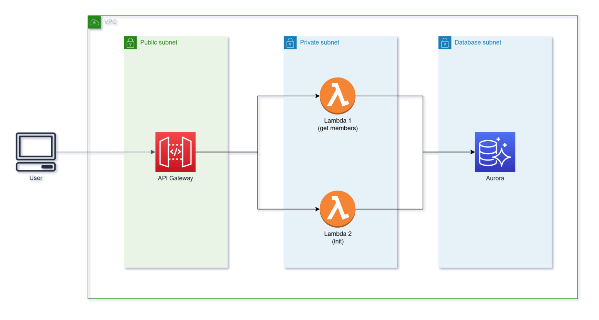

# full-terra

> A Terraform example for backend server with AWS services, including API Gateway, Aurora, IAM, Lambda, Security Group & VPC
> Adding Jenkins very soon.

## Architecture Diagram



## Prerequisite
Make sure you have the latest version of the following before deploying.
- `npm` and `yarn`
- `aws cli`
- `terraform`
- `git`
- The clone of this project
- An valid AWS account ID

# Steps
## 1. Provide values of variables

At the `back/infra_raw` directory, create a `terraform.tfvars` file following the example file `terraform.tfvars.example`, and fill the **account_id** with the AWS account ID as well as set up **db_username** and **db_password** for database username and password.

## 2. Deploy the infrastructure.

```
cd back/infra_raw
terraform init
terraform plan -out=tfplan
terraform apply "tfplan"
```

## 3. Destroy the infrastructure

```
terraform destroy
```